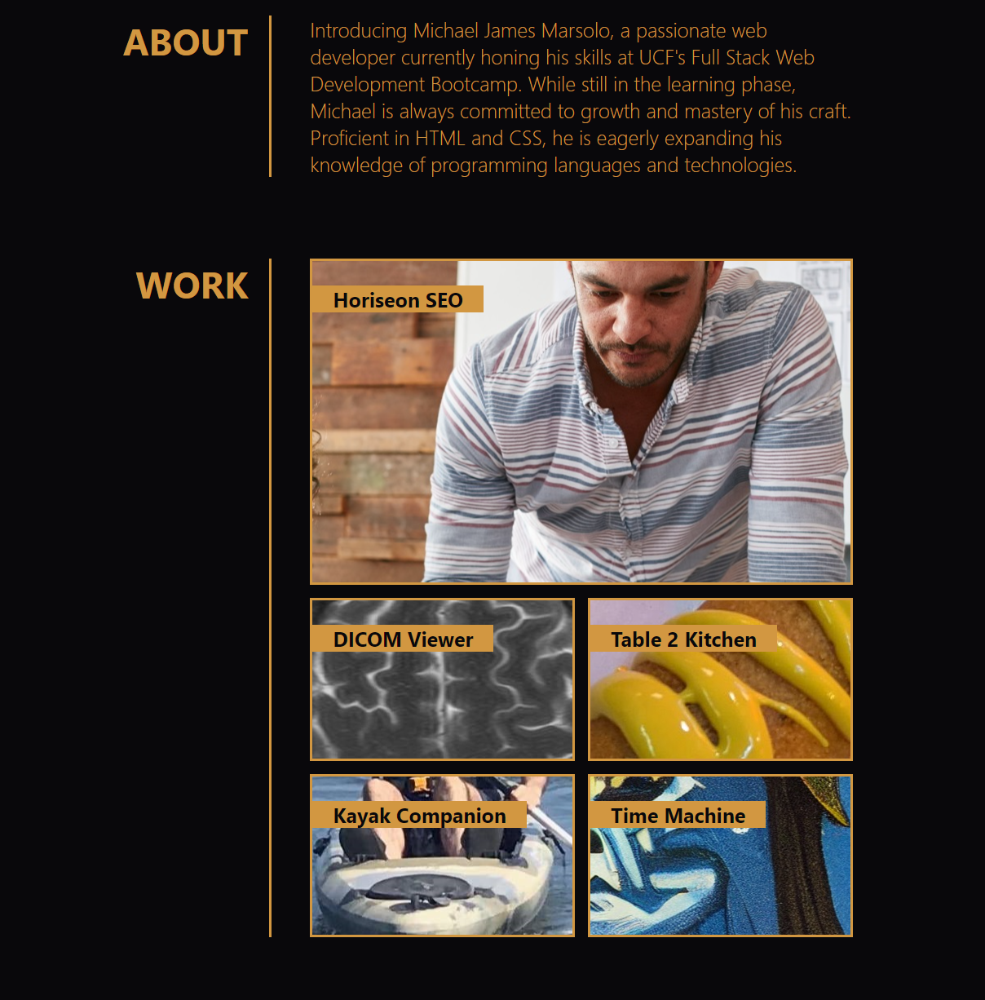

# Web Development Portfolio

This week's challenge focuses on using HTML and advanced CSS techniques to craft 
a personalized website that shows off what I've been learning in class so far.  
I used flexbox and media queries to maintain responsiveness across a variety of 
viewport sizes. The page also uses pseudo-classes, transitions, and animations to 
produce some simple visual effects when interacting with the page.

## Acceptance Criteria:

GIVEN I need to sample a potential employee's previous work  
WHEN I load their portfolio  
THEN I am presented with the developer's name, a recent photo or avatar, and links to sections   about them, their work, and how to contact them  
WHEN I click one of the links in the navigation  
THEN the UI scrolls to the corresponding section  
WHEN I click on the link to the section about their work  
THEN the UI scrolls to a section with titled images of the developer's applications  
WHEN I am presented with the developer's first application  
THEN that application's image should be larger in size than the others  
WHEN I click on the images of the applications  
THEN I am taken to that deployed application  
WHEN I resize the page or view the site on various screens and devices  
THEN I am presented with a responsive layout that adapts to my viewport  

## How To Use

To access the site, simply [click here.](https://elrond-hubbard.github.io/portfolio/)